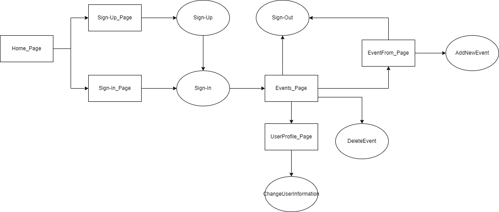

# Professional Development Notebook
Here is Team-Arbitrary's Group Project.

Project Website: https://teamarbitraryproject.000webhostapp.com/

Testing Website: https://arbitrary-tests.000webhostapp.com

Deployment Platform: 000WebHost

Platform Tools:

- File Manager: https://files.000webhost.com/
- Database Manager: https://databases.000webhost.com/

## Temporary Non-Normative Process Design Diagram

[Image File Link](https://github.com/Team-Arbitrary/Team-Arbitrary.github.io/blob/d57831a0b05a916abd3acb211c6434052c5eb0ef/DESIGN/Temporary_Non-Normative_PROCESS_DESIGN_DIAGRAM.drawio.png) and [Design Diagram File Link](https://github.com/Team-Arbitrary/Team-Arbitrary.github.io/blob/d57831a0b05a916abd3acb211c6434052c5eb0ef/DESIGN/Temporary_Non-Normative_PROCESS_DESIGN_DIAGRAM.drawio)

## Coding Conventions:

Abbreviations are not used in any naming to avoid forgetting, misunderstanding, and incomprehension

- Folder, File or Constant for descriptive or for configuration: ALL-CAPS naming + underscore separating "\_" 

  - Example: DOCUMENTATION, PRELIMINARY_INVESTIGATION_REPORT, SERVER_NAME

  

- All naming in MySQL databases [database, table, and field]

  - Example:  arbitrary_team_database, user, password_hash

- General Folder Name: upper CamelCase 

  - Example: Footer

  

- Code File Name [.html, .css, .js, .php]: upper CamelCase

  - Example: Login.html, Login.css, Login.js, Login.php 

  

- Class Name, Function Name: upper CamelCase

  - Example: GoToURL()

  

- Variable Name, ID: lower camelCase

  - Example: passwordHash, 

  

- Specific Resource File Name [.jpg, .png]: lower camelCase
  
  - Example: 

In short, except for the parts that need to capture attention and database, use lower camelCase for things that represent specific instances, and use upper CamelCase for upper-level instances that contain these instances.

### Some Notes for Coding:

Folder naming uses upper CamelCase, to eliminate "-" or "_" to reduce the length of names, to maintain a similar style to other kinds of programming project file structures, and to differentiate from resource files that represent specific instances

Filenames are case-insensitive for files on the Mac and Windows default filesystems, but Linux is sensitive. This is just a reminder here.  ; )

Note the address actually entered into the browser's address bar.

When you update the CSS file, you need to right-click the file list in the network tab of Chrome's developer tools and select clear browser cache, because Chrome will not load the new CSS file until the old CSS file is cleared [or expired?].

The MySQL database automatically converts uppercase letters in most file names to lowercase letters in case-insensitive filesystems.

## Recommended Tools:

Git Management: GitHub Desktop

PHP: PhpStorm

Web Design: Dreamweaver

